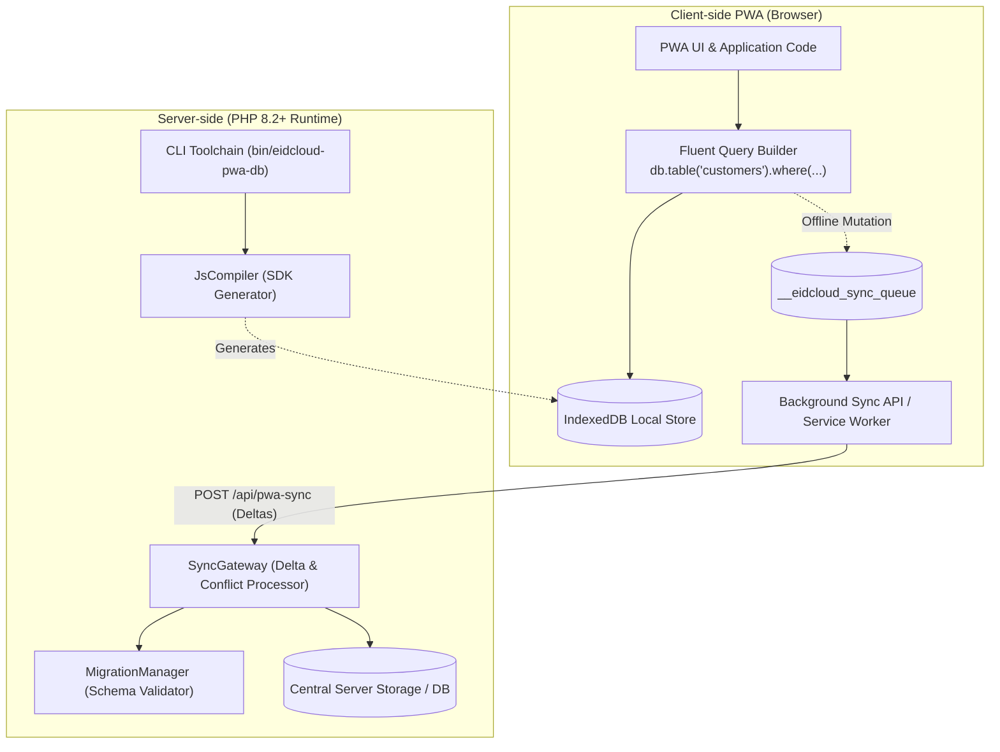

[🇸🇦 العربية](README.ar.md) | [🇬🇧 English](README.md)

# 📱 eidcloud-pwa-db

[](https://github.com/shadialhasan/eidcloud-pwa-db)
[](https://www.php.net/)
[](LICENSE)
[](https://colab.research.google.com/github/shadialhasan/eidcloud-pwa-db/blob/main/notebooks/quickstart.ipynb)

> **Progressive Web App (PWA) offline-first IndexedDB database abstraction with background sync and migration in pure PHP 8.2+ with zero external dependencies.**

---

## 📌 Topics
`eidcloud` • `pwa-database` • `indexeddb` • `offline-first` • `background-sync` • `local-storage` • `php8`

---

## 🚀 Overview & Architecture

`eidcloud-pwa-db` bridges the gap between client-side Progressive Web App (PWA) offline storage and server-side state synchronisation. It compiles a lightweight, reactive IndexedDB client library with a modern fluent query interface, local mutation queueing, and Background Sync API hooks, matched with a pure PHP 8.2+ backend gateway for schema validation, delta reconciliation, and conflict resolution.



---

## ⚡ Capabilities & Features

- **Fluent Client Query Builder**: Query local IndexedDB records intuitively:
  ```javascript
  const activeCustomers = await db.table('customers')
      .where('status', '=', 'active')
      .orderBy('name', 'asc')
      .limit(10)
      .get();
  ```
- **Offline-First Mutation Queue**: Local modifications (`insert`, `update`, `delete`) are committed immediately to IndexedDB and enqueued automatically into `__eidcloud_sync_queue`.
- **Background Sync API Integration**: Automatic registration with the browser Service Worker `SyncManager` for background retries and seamless syncing once back online.
- **Schema Versioning & Auto Migrations**: Define schemas declaratively in JSON; `MigrationManager` coordinates IndexedDB version bumps, object stores, and indices.
- **Zero-Dependency PHP 8.2+ Backend**: High-performance `SyncGateway` validates incoming batches, verifies records, and enforces configurable conflict resolution strategies (`latest_timestamp`, `client_wins`, `server_wins`).
- **Comprehensive CLI Toolchain**: `bin/eidcloud-pwa-db` for compilation, schema validation, and migration manifest generation.

---

## 🛠️ Installation

```bash
composer require eidcloud/pwa-db
```

Or clone directly:
```bash
git clone https://github.com/shadialhasan/eidcloud-pwa-db.git
cd eidcloud-pwa-db
```

---

## 💻 Usage

### 1. Compiling Client JavaScript SDK via CLI
```bash
# Compile SDK with default configuration
php bin/eidcloud-pwa-db compile-sdk --out=./dist/

# Compile SDK using a customized schema definition
php bin/eidcloud-pwa-db compile-sdk --schema=schema.json --out=./dist/
```

### 2. Validating Schemas
```bash
php bin/eidcloud-pwa-db validate-schema schema.json
```

### 3. Client-Side Integration (Browser / PWA)
```html
<script src="/dist/eidcloud-pwa-db.js"></script>
<script>
  const db = EidCloudPwaDb.create({
    syncEndpoint: '/api/pwa-sync'
  });

  async function run() {
    // Insert a new record (automatically enqueued for background sync if offline)
    await db.table('customers').insert({
      id: 'cust-101',
      name: 'Nour AL-Hasan',
      status: 'active',
      email: 'nour@example.com'
    });

    // Query active records locally
    const records = await db.table('customers')
      .where('status', '=', 'active')
      .get();

    console.log('Active Customers:', records);

    // Trigger sync with server manually or via Service Worker
    await db.sync();
  }

  run();
</script>
```

### 4. Server-Side Sync Gateway (PHP 8.2+)
```php
<?php

use EidCloud\PwaDb\Sync\SyncGateway;

$gateway = new SyncGateway($schema, 'latest_timestamp');

// Handle incoming JSON payload from POST /api/pwa-sync
$payloadJson = file_get_contents('php://input');

$responseJson = $gateway->handleJsonEndpoint($payloadJson, function (string $table, string|int $recordId) {
    // Optional lookup callback to fetch existing server record for conflict checking:
    // return Database::find($table, $recordId);
    return null;
});

header('Content-Type: application/json');
echo $responseJson;
```

---

## 🧪 Testing

Run the zero-dependency test suite:
```bash
php tests/run_tests.php
```

---

## 👤 Author & Maintainer

**Eng. MHD. Shadi AL-Hasan**  
- **Role:** Executive CTO & Enterprise Solutions Architect  
- **Email:** [mhd.shadi.alhasan@gmail.com](mailto:mhd.shadi.alhasan@gmail.com)  
- **Phone / WhatsApp:** [+963934005922](tel:+963934005922)  
- **Location:** Damascus, Syria  
- **GitHub:** [shadialhasan](https://github.com/shadialhasan)  

---

## 📄 License

This project is licensed under the MIT License - see the [LICENSE](LICENSE) file for details.  
Copyright (c) 2026 **MHD. Shadi AL-Hasan**. All rights reserved.
